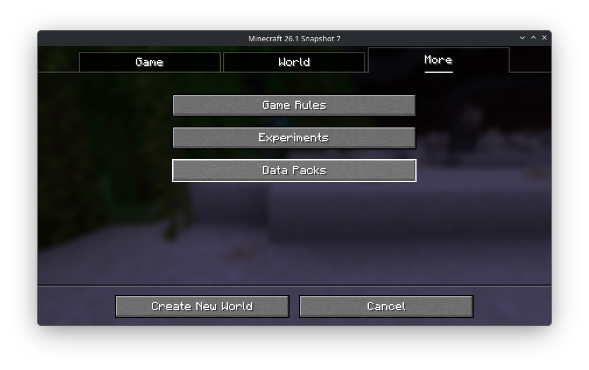
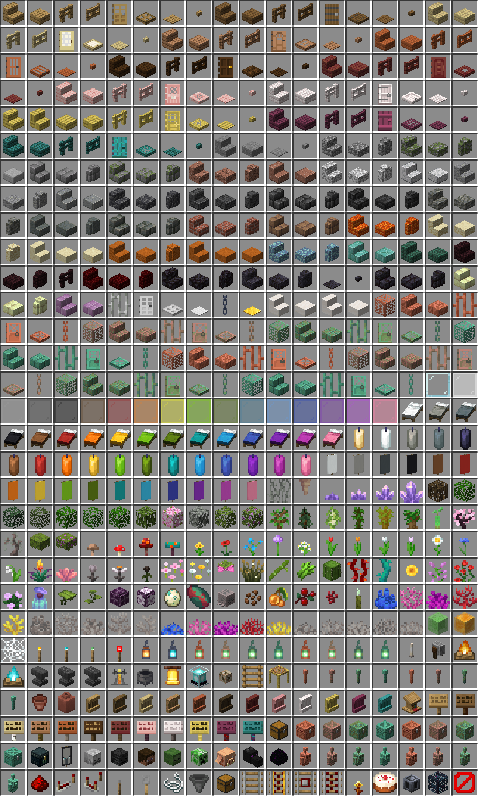

    
    <h3 style="text-align: center; text-transform: uppercase;">Place snow on top of stairs, slabs and many more blocks!</h3>
    

        
        
        
        
    

### ❄ HOW DOES IT WORK?

The way this datapack works is very simple. You just right click with a snow layer the base of any [supported block](#🧊-supported-blocks) to turn it into a _snow-logged_ block!. For this to work, the _snowable_ block must be in valid position and state, and there must be a solid block in front of it. Also, if is a block that requires the player to sneak, the player must no fly and must be on the same level as the block.

> The "solid block in front" requirement is due to the fact that the snow layer is actually placed and immediately removed from the world. Said block must also be one that can actually support the snow layer, despite the fact that it will be removed and that it can also be removed once the target block has been _snow-logged_

If you wish, you can also remove snow from a _snow-logged_ block by right clicking on its base while sneaking with an empty hand.

> The snow layer will not be dropped if the `block_drops` gamerule is set to false

Check the [full list of supported blocks](#🧊-supported-blocks) below to know which blocks you can interact with.

The pack makes use of block displays and per-player scoreboard objectives, so it doesn't require any resource pack and will work in a multiplayer server as well.

Also, the list of blocks that can be _snow-logged_ can be further customized via block tags, so you can make it work with modded blocks as well!

### 🌐 HOW TO DOWNLOAD

You can download the datapack from [CurseForge](https://www.curseforge.com/minecraft/customization/snow-on-stairs-datapack/files) or [Modrinth](https://modrinth.com/datapack/snow-on-stairs/versions).

Once downloaded, just drag the datapack .zip file into your world, and you're good to go!

### 🔧 HOW TO INSTALL

- When creating a new world, go to the `More` tab and click on `Data Packs` 
     

- Drag and drop the datapack file `snow_on_stairs-vX.X-mcVersion` inside the Data Packs screen, enable it and click `Done`

- That's it! You can now place snow layers on top (or under) many blocks in your world!

### 🔗 CAN I CONTRIBUTE?

Everyone can contribute!

You can suggest a feature to add using the [feature request module](https://github.com/JimiIT92/SnowOnStairs/issues/new?template=feature-request.md). Please keep in mind that suggestions must met the datapack criteria in order to be added.

And if you find any issue you can report them using the [Issue Tracker](https://github.com/JimiIT92/SnowOnStairs/issues/new?template=bug-report.md). Remember to add as many details as possible, so I can
easily reproduce the issue and fix it 😉

If you wish you can also show your support via donations, which will be really appreciated. Of course **this is not mandatory** to use the datapack, but as I said they're really appreciated 😁

These are the supported ways to donate:

    
    &emsp;&emsp;&emsp;&emsp;&emsp;
    
     
    

### 📃 CREDITS

This datapack was a slightly modified version of the [Carpet on Stairs Datapack](https://github.com/oOBoomberOo/carpet_on_stairs) by **oOBoomberOo**. While that would still works, it uses commands and techniques that are now outdated (especially the massive use of invisible armor stands with custom block models).

Since minecraft added block display entities and interactions, it is now possible to make the datapack works without a resource pack and, since block displays don't act and tick like regular entities, it significantly improves performances 😁

I also want to thank [n0rd](https://stackoverflow.com/users/31782/n0rd) for helping me with the build script! 😀

Thank you to [GalSergey](https://www.reddit.com/user/GalSergey/) for helping me updating the DataPack to 1.21.4 😄

### 😁 IN CONCLUSION

I hope you like this datapack and the effort put into it to keep it always updated!

I'll support the datapack, and add more blocks as needed, with new versions of Minecraft.

In the meantime I wish you all the best, have a nice day,

**_Jimi_** 🤘🏼

### 📜 CUSTOMIZATION

The datapack uses the following predicates to decide if a block can be _snow-logged_.
You can customize these predicates to extend or change the datapack functionality as you wish

- `snow_on_stairs:is_sweet_berry_bush`
    - Used to determine if a block is a `sweet_berry_bush`. If it is, the block can be snowlogged if is at age `0` or `1`. If is at age `2`, it can only be _snow-logged_ if the player is sneaking
- `snow_on_stairs:should_destroy_snow`
    - Defines when a snow layer placed on or under a block should be removed if the block gets updated
- `snow_on_stairs:valid_for_snow_placment`
    - Defines when a snow layer can be placed on or under a block

Alongside predicates, there are some block tags that are used to control how the snow layer is placed on or under a block

- `#snow_on_stairs:has_lower_interaction`
    - Blocks that has a lower interaction point than normal (0.06 instead of 0.125), allowing them to be interacted and destroyed when _snow-logged_. This includes
        - All pressure plates (under the `#minecraft:pressure_plates` tag)
        - All buttons (under the `#minecraft:buttons` tag)
        - All rails (under the `#minecraft:rails` tag)
        - Redstone repeater
        - Redstone comparator
- `#snow_on_stairs:invalid_for_snow_placement`
    - Blocks that cannot support a snow layer. If a _snowable_ block is on top of one of these block, it can't be _snow-logged_
    - This includes `air` and basically all blocks that don't have a solid top face
- `#snow_on_stairs:snowable_slabs`
    - Slabs that can be _snow-logged_
    - Includes all slabs (under the `#minecraft:slabs`) tag.
        - If a slab is not under the `#minecraft:slabs` tag and is not added to this tag, but is in the `#snow_on_stairs:snowable_blocks` tag, the snow layer will always be placed under the slab, regardless of its state
- `#snow_on_stairs:snowable_stairs`
    - Stairs that can be _snow-logged_
    - Inclused all stairs (under the `#minecraft:stairs`) tag.
        - If a stair is not under the `#minecraft:stairs` tag and is not added to this tag, but is in the `#snow_on_stairs:snowable_block` tag, the snow layer will always be placed under the slab, regardless of its state and shape
- `#snow_on_stairs:snowable_blocks_sneaking`
    - Blocks that can be _snow-logged_ only if the player is sneaking
        - This includes all blocks that have an interaction or a GUI
- `#snow_on_stairs:snowable_blocks_no_sneaking`
    - Blocks that can be _snow-logged_ even if the player is not sneaking
        - All blocks that does not have an interaction or a GUI

### 🧊 SUPPORTED BLOCKS

The supported blocks can be found inside the `#snow_on_stairs:snowable_blocks` tag. Changing the entries in this list will change the list of blocks that can be _snow-logged_. 

> Adding blocks directly to this tag doesn't have effect. You *must* add blocks to the `#snow_on_stairs:snowable_blocks_no_sneaking` or `#snow_on_stairs:snowable_blocks_sneaking` repsectively to make them work

This also mean that you can add modded blocks to this list as well, if they aren't already in other Minecraft Tags (for instance, if a modded stair is inside the `stairs` tag, it will be automatically supported by the datapack!)

The `#snow_on_stairs:snowable` tag can be used inside the Minecraft inventory to quickly see the list of supported blocks.

Here is the current list of blocks that can be _snow-logged_ (assuming no changes has been made to the `#snow_on_stairs:snowable_blocks` tag):

- All Amethyst Buds and Clusters
    - Small Amethyst Bud
    - Medium Amethyst Bud
    - Large Amethyst Bud
    - Amethyst Cluster
- All Anvils (under the `#minecraft:anvil` tag. <u>Requires sneaking</u>)
    - Anvil
    - Chipped Anvil
    - Damaged Anvil
- All Banners (under the `#minecraft:banners` tag)
    - All colored banners
    - All player-made banners
    - Ominous banner
- All Bars (under the `#minecraft:bars` tag)
    - Iron Bars
    - Copper Bars
    - Exposed Copper Bars
    - Weathered Copper Bars
    - Oxidized Copper Bars
    - Waxed Copper Bars
    - Waxed Exposed Copper Bars
    - Waxed Weathered Copper Bars
    - Waxed Oxidized Copper Bars
- All Beds (under the `#minecraft:beds` tag. <u>Requires sneaking</u>)
    - All colored Beds
- All Buttons (under the `#minecraft:buttons` tag. <u>Requires sneaking</u>)
    - Oak Button
    - Spruce Button
    - Birch Button
    - Jungle Button
    - Acacia Button
    - Dark Oak Button
    - Mangrove Button
    - Cherry Button
    - Pale Oak Button
    - Bamboo Button
    - Crimson Button
    - Warped Button
    - Stone Button
    - Polished Blackstone Button
- All Campfires (under the `#minecraft:campfires` tag)
    - Campfire
    - Soul Campfire
- All Candle Cakes (under the `#minecraft:candle_cakes` tag. <u>Requires sneaking</u>)
- All Candles (under the `#minecraft:candles` tag). This inlcude:
    - Candle
    - All colored Candles
- All Cauldrons (under the `#minecraft:cauldrons` tag)
    - Cauldron
    - Water Cauldron
    - Lava Cauldron
    - Powder Snow Cauldron
- All Chains (under the `#minecraft:chains` tag)
    - Iron Chain
    - Copper Chain
    - Exposed Copper Chain
    - Weathered Copper Chain
    - Oxidized Copper Chain
    - Waxed Copper Chain
    - Waxed Exposed Copper Chain
    - Waxed Weathered Copper Chain
    - Waxed Oxidized Copper Chain
- All Copper Chests (under the `#minecraft:copper_chests` tag. <u>Requires sneaking</u>) and regular Chests
    - Chest
    - Trapped Chest
    - Ender Chest
    - Copper Chest
    - Exposed Copper Chest
    - Weathered Copper Chest
    - Oxidized Copper Chest
    - Waxed Copper Chest
    - Waxed Exposed Copper Chest
    - Waxed Weathered Copper Chest
    - Waxed Oxidized Copper Chest
- All Copper Golem Statues (under the `#minecraft:copper_golem_statues` tag. <u>Requires sneaking</u>). This include
    - Copper Golem Statue
    - Exposed Copper Golem Statue
    - Weathered Copper Golem Statue
    - Oxidized Copper Golem Statue
    - Waxed Copper Golem Statue
    - Waxed Exposed Copper Golem Statue
    - Waxed Weathered Copper Golem Statue
    - Waxed Oxidized Copper Golem Statue
- All Copper Grates
    - Copper Grate
    - Exposed Copper Grate
    - Weathered Copper Grate
    - Oxidized Copper Grate
    - Waxed Copper Grate
    - Waxed Exposed Copper Grate
    - Waxed Weathered Copper Grate
    - Waxed Oxidized Copper Grate
- All Corals (under the `#minecraft:corals` tag), Wall Corals (under the `#minecraft:wall_corals` tag) and Dead Corals
    - Tube Coral
    - Dead Tube Coral
    - Tube Coral Fan
    - Dead Tube Coral Fan
    - Brain Coral
    - Dead Brain Coral
    - Brain Coral Fan
    - Dead Brain Coral Fan
    - Bubble Coral
    - Dead Bubble Coral
    - Bubble Coral Fan
    - Dead Bubble Coral Fan
    - Fire Coral
    - Dead Fire Coral
    - Fire Coral Fan
    - Dead Fire Coral Fan
    - Horn Coral
    - Dead Horn Coral
    - Horn Coral Fan
    - Dead Horn Coral Fan
- All Doors (under the `#minecraft:doors` tag. <u>Requires sneaking</u>)
    - Oak Door
    - Spruce Door
    - Birch Door
    - Jungle Door
    - Acacia Door
    - Dark Oak Door
    - Mangrove Door
    - Cherry Door
    - Pale Oak Door
    - Bamboo Door
    - Crimson Door
    - Warped Door
    - Iron Door
    - Copper Door
    - Exposed Copper Door
    - Weathered Copper Door
    - Oxidized Copper Door
    - Waxed Copper Door
    - Waxed Exposed Copper Door
    - Waxed Weathered Copper Door
    - Waxed Oxidized Copper Door
- All Fence Gates (under the `#minecraft:fence_gates` tag. <u>Requires sneaking</u>)
    - Oak Fence Gate
    - Spruce Fence Gate
    - Birch Fence Gate
    - Jungle Fence Gate
    - Acacia Fence Gate
    - Dark Oak Fence Gate
    - Mangrove Fence Gate
    - Cherry Fence Gate
    - Pale Oak Fence Gate
    - Bamboo Fence Gate
    - Crimson Fence Gate
    - Warped Fence Gate
- All Fences (under the `#minecraft:fences` tag)
    - Oak Fence
    - Spruce Fence
    - Birch Fence
    - Jungle Fence
    - Acacia Fence
    - Dark Oak Fence
    - Mangrove Fence
    - Cherry Fence
    - Pale Oak Fence
    - Bamboo Fence
    - Crimson Fence
    - Warped Fence
    - Nether Brick Fence
- All Flower Pots (under the `#minecraft:flower_pots` tag. <u>Requires sneaking</u>)
    - Empty Flower Pot
    - Flower Pot with a flower
- All Flowers (under the `#minecraft:flowers` tag)
    - Dandelion
    - Poppy
    - Blue Orchid
    - Allium
    - Azure Bluet
    - Red Tulip
    - Orange Tulip
    - White Tulip
    - Pink Tulip
    - Oxeye Daisy
    - Cornflower
    - Lily of the Valley
    - Torchflower
    - Cactus Flower
    - Closed Eyeblossom
    - Open Eyeblossom
    - Wither Rose
    - Pink Petals
    - Wildflowers
    - Spore Blossom
    - Sunflower
    - Lilac
    - Rose Bush
    - Peony
    - Pitcher Plant
    - Chorus Flower
    - Golden Dandelion
- All Glass Panes
    - Glass Pane
    - All Stained Glass Panes
- All Lanterns (under the `#minecraft:lanterns` tag)
    - Lantern
    - Soul Lantern
    - Copper Lantern
    - Exposed Copper Lantern
    - Weathered Copper Lantern
    - Oxidized Copper Lantern
    - Waxed Copper Lantern
    - Waxed Exposed Copper Lantern
    - Waxed Weathered Copper Lantern
    - Waxed Oxidized Copper Lantern
- All Leaves (under the `#minecraft:leaves` tag)
    - Oak Leaves
    - Spruce Leaves
    - Birch Leaves
    - Jungle Leaves
    - Acacia Leaves
    - Dark Oak Leaves
    - Mangrove Leaves
    - Cherry Leaves
    - Pale Oak Leaves
    - Azalea Leaves
    - Flowering Azalea Leaves
    - Mangrove Roots
- All Lightning Rods (under the `#minecraft:lightning_rods` tag)
    - Lightning Rod
    - Exposed Lightning Rod
    - Weathered Lightning Rod
    - Oxidized Lightning Rod
    - Waxed Lightning Rod
    - Waxed Exposed Lightning Rod
    - Waxed Weathered Lightning Rod
    - Waxed Oxidized Lightning Rod
- All Mushrooms and Fungi
    - Red Mushroom
    - Brom Mushroom
    - Crimson Fungus
    - Warped Fungus
- All Pressure Plates (under the `#minecraft:pressure_plates` tag)
    - Oak Pressure Plate
    - Spruce Pressure Plate
    - Birch Pressure Plate
    - Jungle Pressure Plate
    - Acacia Pressure Plate
    - Dark Oak Pressure Plate
    - Mangrove Pressure Plate
    - Cherry Pressure Plate
    - Pale Oak Pressure Plate
    - Bamboo Pressure Plate
    - Crimson Pressure Plate
    - Warped Pressure Plate
    - Stone Pressure Plate
    - Polished Blackstone Pressure Plate
    - Heavy Weighted Pressure Plate
    - Light Weighted Pressure Plate
- All Rails (under the `#minecraft:rails` tag)
    - Rail
    - Powered Rail
    - Detector Rail
    - Activator Rail
- All Saplings (under the `#minecraft:saplings` tag)
    - Oak Sapling
    - Spruce Sapling
    - Birch Sapling
    - Jungle Sapling
    - Acacia Sapling
    - Dark Oak Sapling
    - Mangrove Propagule
    - Cherry Sapling
    - Pale Oak Sapling
    - Azalea
    - Flowering Azalea
    - Bamboo Sapling
- All Shelves (under the `#minecraft:wooden_shelves` tag. <u>Requires sneaking</u>)
    - Oak Shelf
    - Spruce Shelf
    - Birch Shelf
    - Jungle Shelf
    - Acacia Shelf
    - Dark Oak Shelf
    - Mangrove Shelf
    - Cherry Shelf
    - Pale Oak Shelf
    - Bamboo Shelf
    - Crimson Shelf
    - Warped Shelf
- All Signs (under the `#minecraft:all_signs` tag. <u>Requires sneaking</u>)
    - Oak Standing Sign
    - Oak Wall Sign
    - Oak Hanging Sign
    - Spruce Standing Sign
    - Spruce Wall Sign
    - Spruce Hanging Sign
    - Birch Standing Sign
    - Birch Wall Sign
    - Birch Hanging Sign
    - Jungle Standing Sign
    - Jungle Wall Sign
    - Jungle Hanging Sign
    - Acacia Standing Sign
    - Acacia Wall Sign
    - Acacia Hanging Sign
    - Dark Oak Standing Sign
    - Dark Oak Wall Sign
    - Dark Oak Hanging Sign
    - Mangrove Standing Sign
    - Mangrove Wall Sign
    - Mangrove Hanging Sign
    - Cherry Standing Sign
    - Cherry Wall Sign
    - Cherry Hanging Sign
    - Pale Oak Standing Sign
    - Pale Oak Wall Sign
    - Pale Oak Hanging Sign
    - Bamboo Standing Sign
    - Bamboo Wall Sign
    - Bamboo Hanging Sign
    - Crimson Standing Sign
    - Crimson Wall Sign
    - Crimson Hanging Sign
    - Warped Standing Sign
    - Warped Wall Sign
    - Warped Hanging Sign
- All Skulls and Heads
    - Skeleton Skull
    - Skeleton Wall Skull
    - Wither Skeleton Skull
    - Wither Skeleton Wall Skull
    - Player Head
    - Player Wall Head
    - Custom Player Head
    - Custom Player Wall Head
    - Zombie Head
    - Zombie Wall Head
    - Creeper Head
    - Crepper Wall Head
    - Piglin Head
    - Piglin Wall Head
    - Dragon Head
    - Dragon Wall Head
- All Slabs (under the `#minecraft:slabs` tag)
    - Oak Slab
    - Spruce Slab
    - Birch Slab
    - Jungle Slab
    - Acacia Slab
    - Dark Oak Slab
    - Mangrove Slab
    - Cherry Slab
    - Pale Oak Slab
    - Bamboo Slab
    - Bamboo Mosaic Slab
    - Crimson Slab
    - Warped Slab
    - Stone Slab
    - Cobblestone Slab
    - Mossy Cobblestone Slab
    - Smooth Stone Slab
    - Stone Brick Slab
    - Mossy Stone Brick Slab
    - Granite Slab
    - Polished Granite Slab
    - Diorite Slab
    - Polished Diorite Slab
    - Andesite Slab
    - Polished Andesite Slab
    - Cobbled Deepslate Slab
    - Poished Deepslate Slab
    - Deepslate Brick Slab
    - Deepslate Tile Slab
    - Tuff Slab
    - Polished Tuff Slab
    - Tuff Brick Slab
    - Brick Slab
    - Mud Brick Slab
    - Resin Brick Slab
    - Sandstone Slab
    - Smooth Sandstone Slab
    - Cut Sandstone Slab
    - Red Sandstone Slab
    - Smooth Red Sandstone Slab
    - Cut Red Sandstone Slab
    - Prismarine Slab
    - Prismarine Brick Slab
    - Dark Prismarine Slab
    - Nether Brick Slab
    - Red Nether Brick Slab
    - Blackstone Slab
    - Polished Blackstone Slab
    - Polished Blackstone Brick Slab
    - End Stone Brick Slab
    - Purpur Slab
    - Quartz Slab
    - Smooth Quartz Slab
    - Cut Copper Slab
    - Exposed Cut Copper Slab
    - Weathered Cut Copper Slab
    - Oxidized Cut Copper Slab
    - Waxed Cut Copper Slab
    - Waxed Exposed Cut Copper Slab
    - Waxed Weathered Cut Copper Slab
    - Waxed Oxidized Cut Copper Slab
- All Stairs (under the `#minecraft:stairs` tag)
    - Oak Stairs
    - Spruce Stairs
    - Birch Stairs
    - Jungle Stairs
    - Acacia Stairs
    - Dark Oak Stairs
    - Mangrove Stairs
    - Cherry Stairs
    - Pale Oak Stairs
    - Bamboo Stairs
    - Bamboo Mosaic Stairs
    - Crimson Stairs
    - Warped Stairs
    - Stone Stairs
    - Cobblestone Stairs
    - Mossy Cobblestone Stairs
    - Stone Brick Stairs
    - Mossy Stone Brick Stairs
    - Granite Stairs
    - Polished Granite Stairs
    - Diorite Stairs
    - Polished Diorite Stairs
    - Andesite Stairs
    - Polished Andesite Stairs
    - Cobbled Deepslate Stairs
    - Poished Deepslate Stairs
    - Deepslate Brick Stairs
    - Deepslate Tile Stairs
    - Tuff Stairs
    - Polished Tuff Stairs
    - Tuff Brick Stairs
    - Brick Stairs
    - Mud Brick Stairs
    - Resin Brick Stairs
    - Sandstone Stairs
    - Smooth Sandstone Stairs
    - Red Sandstone Stairs
    - Smooth Red Sandstone Stairs
    - Prismarine Stairs
    - Prismarine Brick Stairs
    - Dark Prismarine Stairs
    - Nether Brick Stairs
    - Red Nether Brick Stairs
    - Blackstone Stairs
    - Polished Blackstone Stairs
    - Polished Blackstone Brick Stairs
    - End Stone Brick Stairs
    - Purpur Stairs
    - Quartz Stairs
    - Smooth Quartz Stairs
    - Cut Copper Stairs
    - Exposed Cut Copper Stairs
    - Weathered Cut Copper Stairs
    - Oxidized Cut Copper Stairs
    - Waxed Cut Copper Stairs
    - Waxed Exposed Cut Copper Stairs
    - Waxed Weathered Cut Copper Stairs
    - Waxed Oxidized Cut Copper Stairs
- All Trapdoors (under the `#minecraft:trapdoors` tag. <u>Requires sneaking</u>)
    - Oak Trapdoor
    - Spruce Trapdoor
    - Birch Trapdoor
    - Jungle Trapdoor
    - Acacia Trapdoor
    - Dark Oak Trapdoor
    - Mangrove Trapdoor
    - Cherry Trapdoor
    - Pale Oak Trapdoor
    - Bamboo Trapdoor
    - Crimson Trapdoor
    - Warped Trapdoor
    - Iron Trapdoor
    - Copper Trapdoor
    - Exposed Copper Trapdoor
    - Weathered Copper Trapdoor
    - Oxidized Copper Trapdoor
    - Waxed Copper Trapdoor
    - Waxed Exposed Copper Trapdoor
    - Waxed Weathered Copper Trapdoor
    - Waxed Oxidized Copper Trapdoor
- All Torches
    - Torch
    - Wall Torch
    - Soul Torch
    - Soul Wall Torch
    - Copper Torch
    - Copper Wall Torch
    - Redstone Torch
    - Redstone Wall Torch
- All Walls (under the `#minecraft:walls` tag)
    - Cobblestone Wall
    - Mossy Cobblestone Wall
    - Stone Brick Wall
    - Mossy Stone Brick Wall
    - Granite Wall
    - Diorite Wall
    - Andesite Wall
    - Cobbled Deepslate Wall
    - Polished Deepslate Wall
    - Deepslate Brick Wall
    - Deepslate Tile Wall
    - Tuff Wall
    - Polished Tuff Wall
    - Tuff Brick Wall
    - Brick Wall
    - Mud Brick Wall
    - Resin Brick Wall
    - Sandstone Wall
    - Red Sandstone Wall
    - Prismarine Wall
    - Nether Brick Wall
    - Red Nether Brick Wall
    - Blackstone Wall
    - Polished Blackstone Wall
    - Polished Blackstone Brick Wall
    - End Stone Brick Wall
- Bamboo
- Barrier
- Beacon (<u>Requires sneaking</u>)
- Bell (<u>Requires sneaking</u>)
- Big Dripleaf
- Brewing Stand (<u>Requires sneaking</u>)
- Cactus
- Cake (<u>Requires sneaking</u>)
- Cave Vines
- Chorus Plant
- Cobweb
- Cocoa
- Comparator (<u>Requires sneaking</u>)
- Conduit
- Creeper Head
- Decorated Pot (<u>Requires sneaking</u>)
- Dragon Egg (<u>Requires sneaking</u>)
- Dragon Head
- Dried Ghast
- End Rod
- Firefly Bush
- Grindstone (<u>Requires sneaking</u>)
- Heavy Core
- Honey Block
- Hopper (<u>Requires sneaking</u>)
- Ladder
- Lectern (<u>Requires sneaking</u>)
- Lever (<u>Requires sneaking</u>)
- Monster Spawner
- Nether Wart
- Pale Hanging Moss
- Pointed Dripstone
- Redstone (<u>Requires sneaking</u>)
- Repeater (<u>Requires sneaking</u>)
- Scaffolding
- Sea Pickle
- Slime Block
- Small Dripleaf
- Sniffer Egg
- String
- Sugar Cane
- Sweet Berry Bush (<u>Age 2 requires sneaking</u>)
- Tripwire Hook
- Turtle Egg
- Twisting Vines
- Weeping Vines