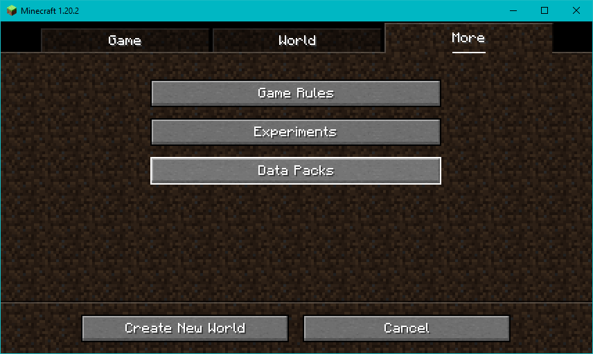

    
    <h3 style="text-align: center; text-transform: uppercase;">Place snow on top of stairs, slabs and many more blocks!</h3>
    

        
        
        
    

### ❄ HOW DOES IT WORK?

The way this datapack works is very simple. You just right click, while sneaking, with a snow layer the base of any [supported block](#🧊-supported-blocks) to turn it into a "snow-logged" block!

https://github.com/JimiIT92/SnowOnStairs/assets/14943331/557c1925-04ac-4617-95da-241c812fc837

Check the [full list of supported blocks](#🧊-supported-blocks) below to know which blocks you can interact with.

Make sure to also use the provided resource pack, otherwise you won't be able to see the "snow-logged" blocks!

### 🌐 HOW TO DOWNLOAD

You can download both the datapack and the resource pack from [CurseForge](https://www.curseforge.com/minecraft/customization/snow-on-stairs-datapack/files).

Inside the ZIP file youll find both the datapack and the resourcepack. Make sure to install them correctly,
otherwise things may not work properly.

You can find instructions on how to install the datapack and the resource pack [below](#🔧-how-to-install) or inside the `HOW TO INSTALL.txt` file

### 🔧 HOW TO INSTALL

- Extract the datapack and resourcepack archives from the downloaded ZIP file 
 

- #### INSTALLING THE DATA PACK

    - When creating a new world, go to the `More` tab and click on `Data Packs` 
     

    - Drag and drop the datapack file `snow_on_stairs-datapack-vX.X-mcVersion` inside the Data Packs screen, enable it and click `Done`

https://github.com/JimiIT92/SnowOnStairs/assets/14943331/21c7856d-90f8-430d-87f4-a9e0a2e4bc5c

- #### INSTALLING THE RESOURCE PACK

    - From the main menu, or after joining a world with the Data Pack enabled, click `Options` and then `Resource Packs...`  

    - Drag and drop the resourcepack file `snow_on_stairs-resourcepack-vX.X-mcVersion` inside the Resource Packs screen, enable it and click `Done`

https://github.com/JimiIT92/SnowOnStairs/assets/14943331/cdd1f281-cf22-40eb-82c7-15369c3c1548

### 🔗 CAN I CONTRIBUTE?

Everyone can contribute!

You can suggest a feature to add using the [feature request module](https://github.com/JimiIT92/SnowOnStairs/issues/new?template=feature-request.md). Please keep in mind that suggestions must met the datapack criteria in order to be added.

And if you find any issue you can report them using the [Issue Tracker](https://github.com/JimiIT92/SnowOnStairs/issues/new?template=bug-report.md). Remember to add as many details as possible, so I can
easily reproduce the issue and fix it 😉

If you wish you can also show your support via donations, which will be really appreciated. Of course **this is not mandatory** to use the datapack, but as I said they're really appreciated 😁

These are the supported ways to donate:

    
    &emsp;&emsp;&emsp;&emsp;&emsp;
    
     
    

### 📃 CREDITS

This datapack is a slightly modified version of the [Carpet on Stairs Datapack](https://github.com/oOBoomberOo/carpet_on_stairs) by **oOBoomberOo**. Basically all the functions and commands remained untouched, so all credits goes to him for the original work and idea! 😁

### 😁 IN CONCLUSION

I hope you like this datapack and the effort put into it to keep it always updated!

I'll support the datapack, and add more blocks as needed, with new versions of Minecraft.

In the meantime I wish you all the best, have a nice day,

**_Jimi_** 🤘🏼

### 🧊 SUPPORTED BLOCKS

The supported blocks can be found inside the `#snow_on_stairs:snowable` tag. Changing the entries in this list will change the list of blocks that can be "snow-logged". This also mean that other datapacks or mods can add their blocks to this list, if they aren't already in other Minecraft Tags (for instance, if a modded stair is inside the `stairs` tag, it will be automatically supported by the datapack!)

The `#snow_on_stairs:snowable` tag can be used inside the Minecraft inventory to quickly see the list of supported blocks.

Here is the current list of blocks that can be "snow-logged" (assuming no changes has been made to the `#snow_on_stairs:snowable` tag):

- All stairs (under the `#minecraft:stairs` tag)
- All slabs (under the `#minecraft:slabs` tag)
- All doors (under the `#minecraft:doors` tag)
- All trapdoors (under the `#minecraft:trapdoors` tag)
- All flowers (under the `#minecraft:flowers` tag). This include:
    - All small flowers (under the `#minecraft:small_flowers` tag)
    - All tall flowers (under the `#minecraft:tall_flowers` tag)
    - Flowering Azalea Leaves
    - Mangrove Propagule
    - Cherry Leaves
    - Pink Petals
- All saplings (under the `#minecraft:saplings` tag). This include:
    - All tree saplings
    - Mangrove propagule
    - Azalea
    - Flowering Azalea
    - Bamboo sapling
- All fences (under the `#minecraft:fences` tag)
- All fence gates (under the `#minecraft:fence_gates` tag)
- All walls (under the `#minecraft:walls` tag)
- All banners (under the `#minecraft:banners` tag). This include:
    - All colored banners
    - The Ominous banner
    - All player-made banners
- All signs (under the `#minecraft:signs` tag)
- All beds (under the `#minecraft:beds` tag)
- All buttons (under the `#minecraft:buttons` tag)
- All pressure plates (under the `#minecraft:pressure_plates` tag)
- All rails (under the `#minecraft:rails` tag)
- All anvil states (under the `#minecraft:anvil` tag)
- All torches. This include:
    - Torch
    - Soul Torch
    - Redstone Torch
- All chests. This include:
    - Chest
    - Trapped Chest
    - Ender Chest
- All skulls and heads. This include:
    - Skeleton Skull
    - Wither Skeleton Skull
    - Zombie Head
    - Creeper Head
    - Dragon Head
    - Player Heads (including custom ones)
- All glass blocks. These include:
    - Glass
    - Colored Glass Blocks
- All glass panes. These include:
    - Glass Pane
    - Colored Glass Panes
- Iron Bars
- Lever
- Repeater
- Comparator
- Redstone
- Hopper
- Red Mushroom
- Brown Mushroom
- Bamboo
- Sea Pickle
- Chorus Plant
- Chorus Flower
- Cactus
- Sugar Cane
- Kelp
- Cobweb
- String
- Tripwire Hook
- Ladder
- Scaffolding
- Turtle Egg
- Conduit
- Cauldron
- Brewing Stand
- Cake
- Bell
- Grindstone
- Lantern
- Soul Lantern
- Chain
